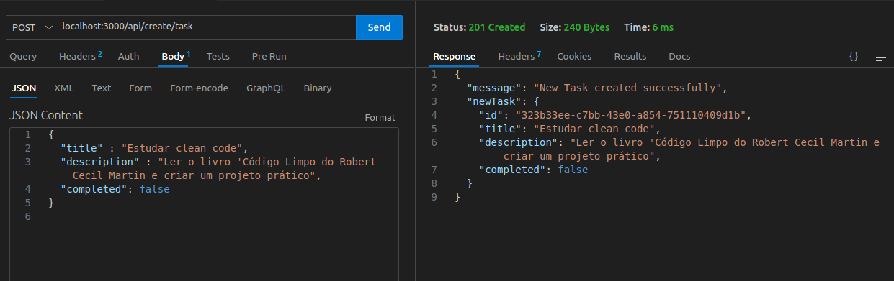
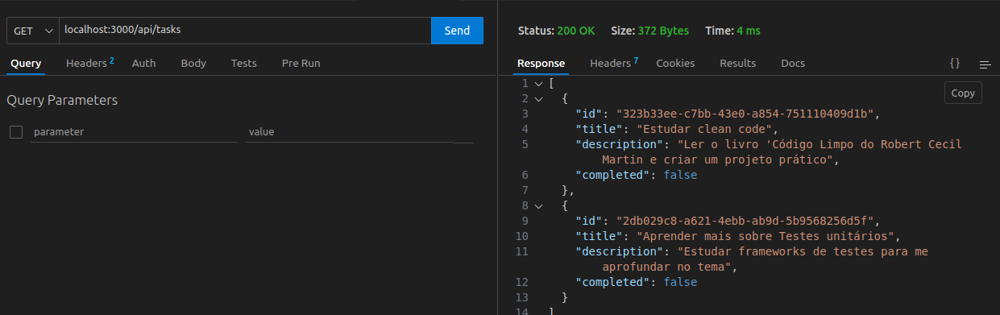
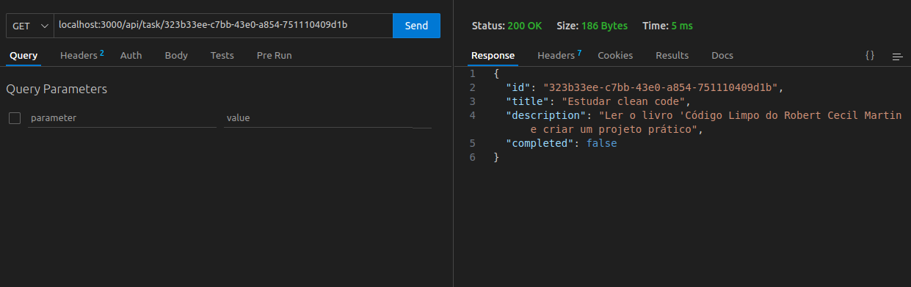
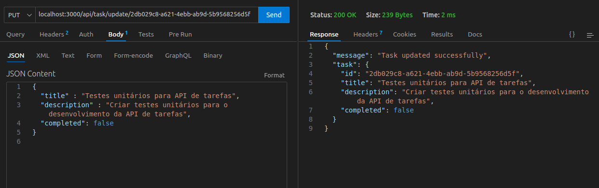
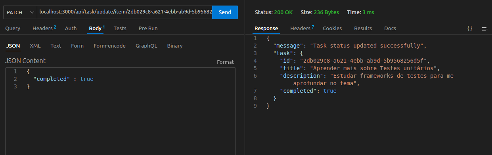
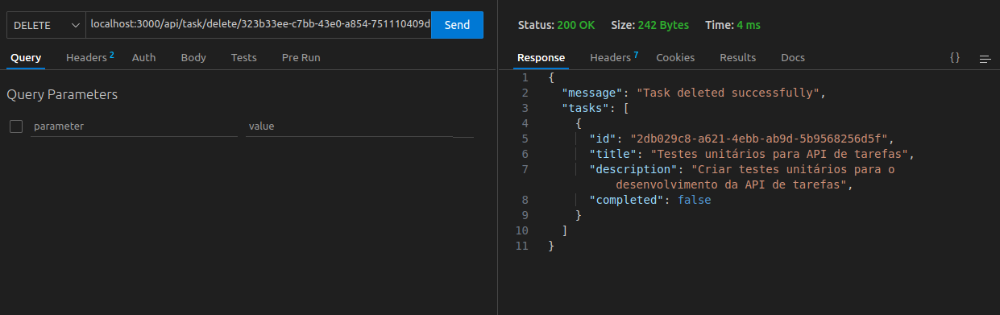

### Projeto Pretalab - 01: API de tarefas

<p align="center">
  
</p>


Este é um projeto simples de uma API RESTful para gerenciamento de tarefas, criado durante o curso **Aprofunda Backend** da **PretaLab**.

---

### Funcionalidades

- Listar todas as tarefas
- Buscar uma tarefa pelo ID
- Criar nova tarefa
- Atualizar uma tarefa inteira
- Atualizar status da tarefa
- Deletar tarefa

---

### Tecnologias usadas

- Node.js
- Express
- UUID (para gerar IDs únicos)
- CORS (para rodar em diferentes navegadores)

---

###  Como rodar

1. Clone o repositório
2. Rode `npm install` para instalar dependências
3. Inicie o servidor:
   ```bash
   node server.js

---

## 🧪 Testes realizados

Abaixo estão alguns exemplos de requisições feitas à API usando o ThunderClient.

---

#### 1. ✅ Criar uma nova tarefa

📸 *Requisição POST para `/api/create/task`*



---

#### 2. ✅ Listar todas as tarefas

📸 *Requisição GET para `/api/tasks`*



---

#### 2. ✅ Get de um item da lista de tarefas

📸 *Requisição GET para `/api/task/:id`*




---

#### 3. ✅ Atualizar tarefa

📸 *Requisição PUT para `/api/task/update/:id`*



---

#### 4. ✅ Atualizar status da tarefa

📸 *Requisição PATCH para `/api/task/update/item/:id`*



---

#### 5. ✅ Deletar tarefa

📸 *Requisição DELETE para `/api/task/delete/:id`*



---


